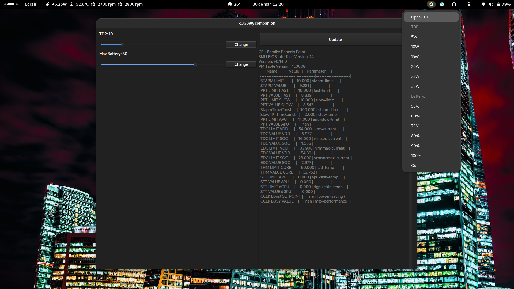

# Ally Companion
This application, intricately crafted to harmonize with ROG Ally, simplifies the task of adjusting TDP and selecting the maximum battery charge possible within the ROG Ally interface.
Ps:. Linux only.
## Build
Make sure to install Rust, clone the git repository, and perform a 'cargo build --release' command. The app will be located in 'ally-companion/target/release'.
## Startup
Edit the Ally Companion.desktop file (Exec) to point to your binary and copy it to ~/.config/autostart, or use jdSimpleAutostart and menulibre to add it to the menu.
## Binary
I'm not sure if it will work, but there's a binary that can be downloaded here: https://github.com/mjsf12/ally-companion/releases
## Image

## Todo
- Save settings
- Automatically update configurations when modified.
- Fix the slider bug.
## About
This is my first Rust app, so it's not the best, and English isn't my first language. This app is being developed as part of my learning process.
